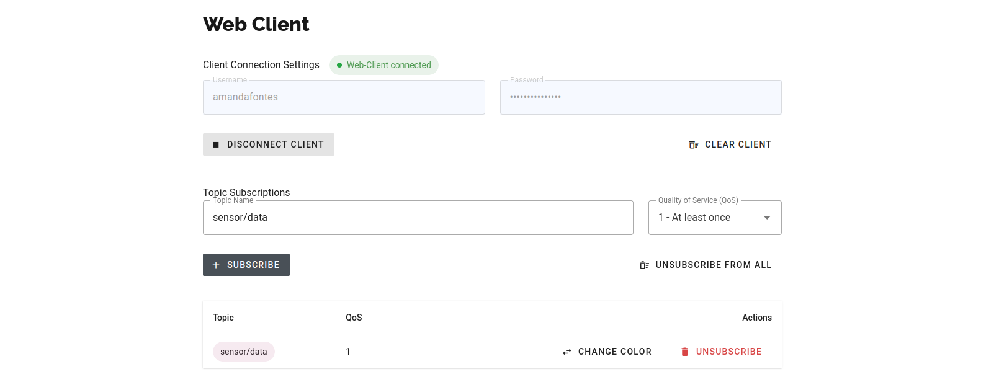

<h2>Ponderada 3 | Integração do Simulador com HiveMQ</h2>

O presente diretório é destinado à entrega da atividade referente à integração das duas atividades ponderadas anteriores com um cluster configurado no HiveMQ.

<h3>Introdução à atividade</h3>

Nessa atividade, deve-se desenvolver a integração entre o simulador desenvolvido nas duas primeiras atividades ponderadas e um cluster configurado no HiveMQ. Para tal, deve-se garantir que o simulador é capaz de se comunicar utilizando autenticação em camada de transporte (TLS).

<h3>Implementação</h3>

Sabendo-se que, nas duas atividades ponderadas anteriores, foi desenvolvido um sistema publisher-subscriber com testes implementados, a ideia é integrar o que foi realizado com um cluster configurado em HiveMQ. Para a implementação do cluster, foi necessário configurá-lo no <a href="https://console.hivemq.cloud/">HiveMQ</a>.

É importante destacar que o HiveMQ, enquanto broker MQTT, possibilita a autenticação por segurança na camada de transporte (TLS). Essa verificação é habilitada por padrão ao criar o cluster. Abaixo, é possível conferir uma imagem que demonstra a criação do cluster.
 

</img>
 

Ainda no HiveMQ, foi necessário criar e configurar as credenciais de conexão necessárias para acesso ao cluster. Foram definidos, na aba <code>Access Management</code>, um nome de usuário e uma senha, com permissão <code>Publish and Subscribe</code>. As credenciais foram, posteriormente, acrescentadas ao código por meio da leitura de um <code>.env</code>, para que fosse possível estabelecer a conexão entre o publicador de mensagens e o cluster.

Uma vez adaptado o código relativo ao publicador de mensagens, foi necessário configurar a conexão na aba <code>Web Client</code>, em que foram inseridas as credenciais criadas e, posteriormente, realizada a subscrição ao tópico em que as mensagens estão sendo publicadas, <code>sensor/data</code>, com um Quality of Service (QoS) igual a 1.

</img>
 

Para executar o sistema elaborado, basta rodar o código referente ao publicador no terminal, uma vez realizadas as configurações necessárias no HiveMQ.
